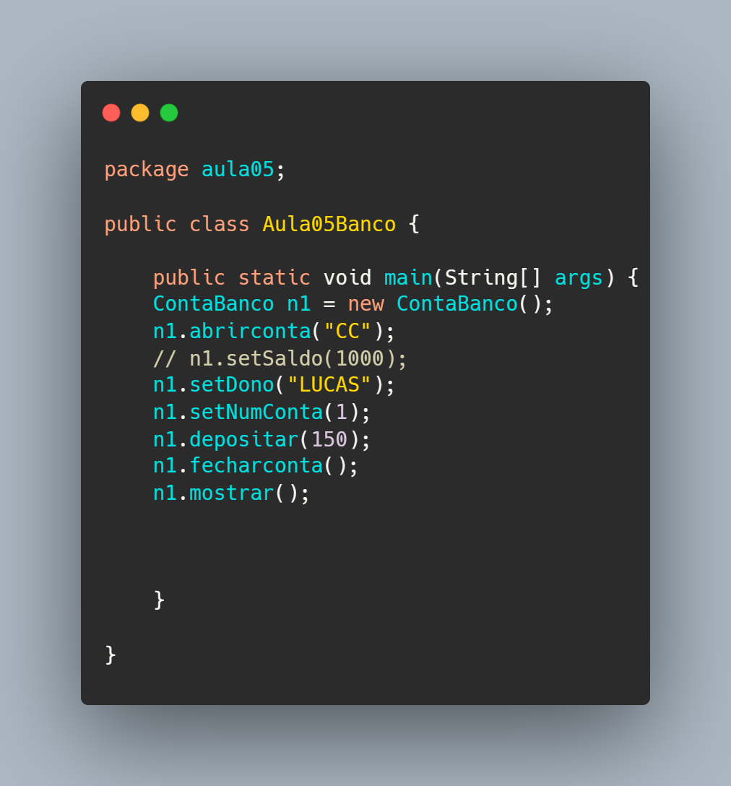
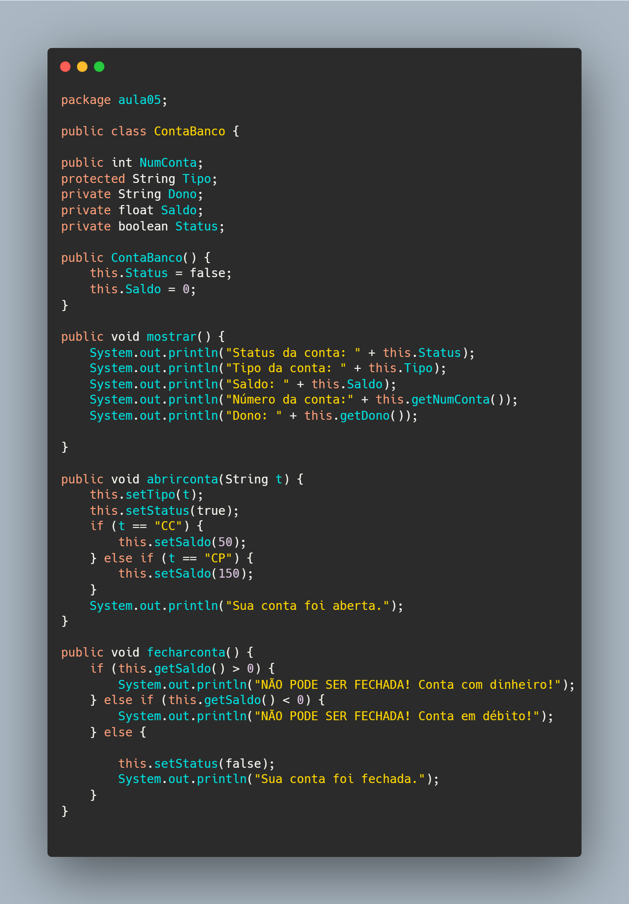
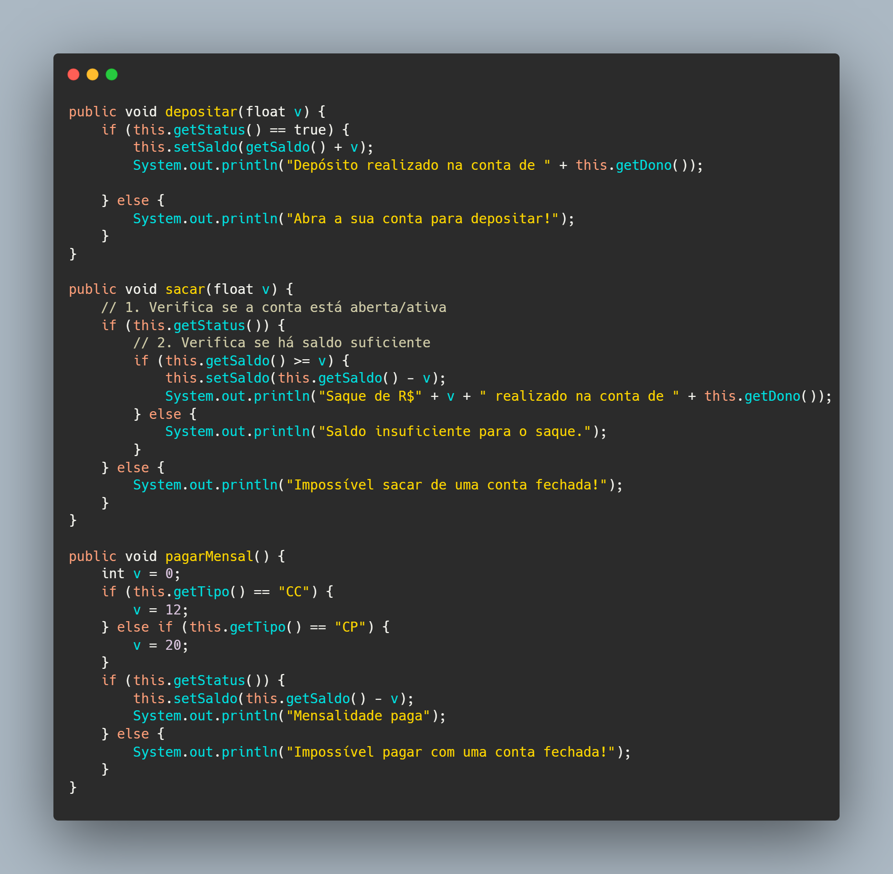
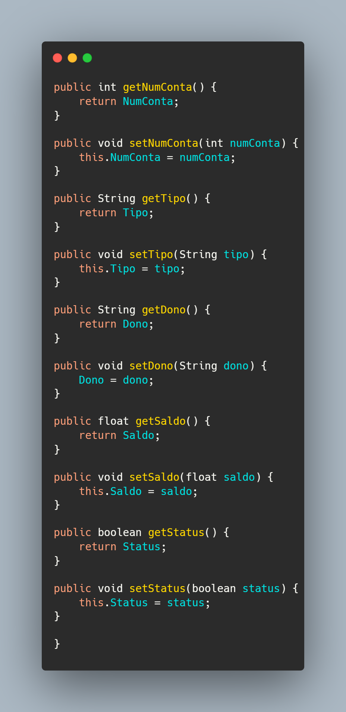

# 🏦 Sistema de Conta Bancária - Java POO

Este repositório contém a implementação de um sistema simplificado de conta bancária, desenvolvido para praticar os pilares da **Programação Orientada a Objetos (POO)** em Java. O projeto simula operações reais de abertura, fechamento e movimentação financeira de contas correntes e poupanças.

## 🎯 Objetivos do Projeto
O foco principal deste exercício foi a aplicação prática de:
*   **Encapsulamento**: Uso de modificadores de acesso (`public`, `private` e `protected`) para proteger a integridade dos dados.
*   **Métodos Especiais**: Implementação de Getters, Setters e Método Construtor.
*   **Lógica de Negócio**: Tradução de requisitos e regras bancárias em código funcional.

## 🛠️ Regras de Negócio Implementadas
De acordo com o planejamento do projeto, as seguintes regras foram estabelecidas:

| Operação | Regras Aplicadas |
| :--- | :--- |
| **Abertura de Conta** | O cliente escolhe entre CC (ganha R$ 50,00) ou CP (ganha R$ 150,00). O status inicial passa para `true`. |
| **Fechamento** | Só é permitido se o saldo for exatamente 0. O sistema bloqueia se houver saldo positivo ou débito. |
| **Depósito/Saque** | A conta deve estar ativa (`status = true`). Para saques, é obrigatório ter saldo suficiente. |
| **Mensalidade** | Cobrança automática de R$ 12,00 (CC) ou R$ 20,00 (CP) diretamente no saldo. |

## 💻 Estrutura do Código
*   `ContaBanco.java`: Classe que contém todos os atributos (NumConta, Tipo, Dono, Saldo, Status) e os métodos de operação.
*   `Aula05Banco.java`: Classe principal utilizada para testar as instâncias e validar as regras de negócio.

## 🚀 Como Executar
1. Certifique-se de ter o **JDK** instalado.
2. Clone o repositório:
   ```bash
   git clone https://github.com/SEU-USUARIO/nome-do-repositorio.git
   ```
3. Compile e execute a classe `Aula05Banco.java`.

---
*Este projeto faz parte do meu aprendizado contínuo em Java e desenvolvimento de software.*
---





---
